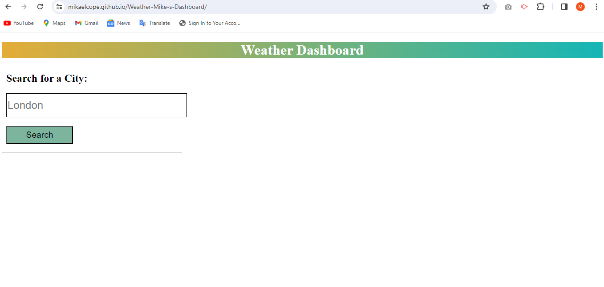

# Weather-Mike-s-Dashboard
A dashboard displaying weather for the next 5 days in your selected city.

## Description
I have created a URL that has a weather report function based off of an input city. Users insert a city of choice and click search. This generates the weather report for the day as well as a forcast for the following 5 days. It extracts this information using API for the following website: https://openweathermap.org/ .

### Installation
Click on the following link to access the URL:
https://mikaelcope.github.io/Weather-Mike-s-Dashboard/

### Usage
Once the URL has loaded this is what you will see: 
 
User can input a city of choice from around the world and click search.  
If the input is a calid city, both current weather and a 5 day forecast will be displayed. 

### Credits
EdX front end web development course.
Open Weather API: https://openweathermap.org/

### License
MIT License

Copyright (c) [2023] [Mikael Cope]

Permission is hereby granted, free of charge, to any person obtaining a copy
of this software and associated documentation files (the "Software"), to deal
in the Software without restriction, including without limitation the rights
to use, copy, modify, merge, publish, distribute, sublicense, and/or sell
copies of the Software, and to permit persons to whom the Software is
furnished to do so, subject to the following conditions:

The above copyright notice and this permission notice shall be included in all
copies or substantial portions of the Software.

THE SOFTWARE IS PROVIDED "AS IS", WITHOUT WARRANTY OF ANY KIND, EXPRESS OR
IMPLIED, INCLUDING BUT NOT LIMITED TO THE WARRANTIES OF MERCHANTABILITY,
FITNESS FOR A PARTICULAR PURPOSE AND NONINFRINGEMENT. IN NO EVENT SHALL THE
AUTHORS OR COPYRIGHT HOLDERS BE LIABLE FOR ANY CLAIM, DAMAGES OR OTHER
LIABILITY, WHETHER IN AN ACTION OF CONTRACT, TORT OR OTHERWISE, ARISING FROM,
OUT OF OR IN CONNECTION WITH THE SOFTWARE OR THE USE OR OTHER DEALINGS IN THE
SOFTWARE.